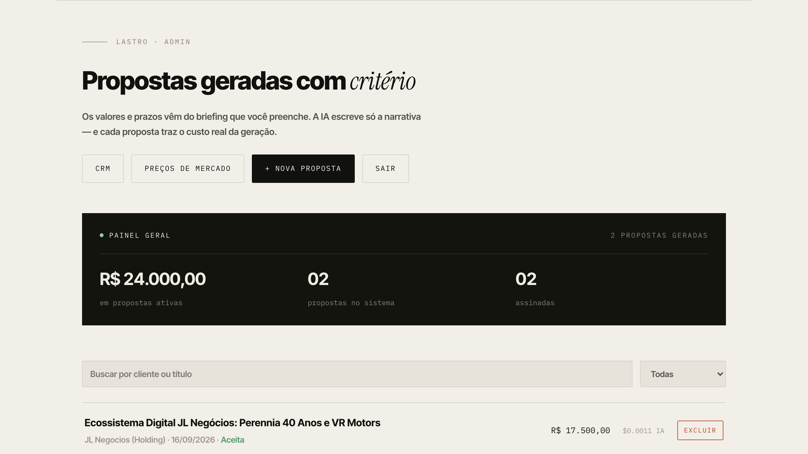

# Lastro



A reunião com o cliente novo ninguém delega no começo — é ali que você aprende o jogo, sente a dor de quem tá do outro lado, calibra o preço. Isso, na UKode Labs, continua sendo feito por gente. O problema começa depois: muita agência, muita consultoria, muito prestador de serviço bom demora dias pra mandar a proposta comercial daquela reunião. Não é força de expressão — às vezes são 3, 4 dias, às vezes uma semana, pra entregar um PDF que leva uns 30 minutos de trabalho de verdade pra escrever. Nesse intervalo o cliente esfria, compara com quem respondeu no mesmo dia, ou esquece por que te chamou.

A parte mecânica de montar esse documento também não ajuda: abrir a última proposta parecida, trocar nome de cliente, recalcular os valores, reescrever o resumo executivo pra soar específico daquele projeto, torcer pra não ter esquecido de atualizar um número em algum canto. E quando você usa IA pra acelerar a redação, sobra a dúvida oposta: quais desses números o modelo realmente calculou e quais ele só *parece* ter calculado?

O **Lastro** nasceu pra resolver as duas coisas ao mesmo tempo: tirar o trabalho braçal de montar o documento — e o atraso de dias que ele costuma custar — e deixar explícito, na própria proposta, o que é dado que você digitou e o que é texto que a IA escreveu. O nome é literal — lastro é o que dá respaldo real a alguma coisa, como o lastro de uma moeda. Aqui, todo número da proposta tem lastro no que você preencheu, nunca no que o modelo inventou.

## O que ele faz

1. **`/` é a porta pública** — a landing page do Lastro, sem nenhum dado de cliente. Só tem um botão: "Entrar".
2. **Você entra com a senha do estúdio** em `/login` e cai no painel interno.
3. **Você preenche um briefing estruturado** em `/admin/novo` — cliente, frentes de escopo, itens de investimento, condições de pagamento, recorrência mensal e cronograma. Todo número que importa é digitado por você, não pela IA.
4. **A IA escreve só a narrativa.** Ao enviar o briefing, o `deepseek-flash` recebe apenas o que você preencheu e devolve resumo executivo, uma introdução por frente de escopo, próximos passos e um fechamento — nunca um valor ou prazo novo.
5. **A proposta nasce pronta**, no layout de documento comercial, assinada com a identidade da UKode Labs, e fica salva com link próprio e público em `/propostas/[id]` — é esse link que você manda pro cliente, sem exigir login dele.
6. **Cada item pode ser comparado com o mercado.** Se você marcar a categoria de um item (ex: "Catálogo Digital / E-commerce MVP"), a proposta mostra a faixa de preço de SP/BR ao lado do valor cobrado.
7. **O cliente assina direto na página.** Sem PDF, sem e-mail de ida e volta: ele desenha a assinatura, o sistema grava nome, traço e data/hora — e o status da proposta muda pra "Aceita" sozinho.
8. **Você manda a proposta por e-mail direto do painel**, com um PDF em anexo (gerado a partir da própria página, não de um template separado) e o link pra revisar e assinar — sem sair do navegador pra caçar o e-mail do cliente ou anexar arquivo manualmente.
9. **Você acompanha o funil no CRM** em `/admin/crm` — um board por status (enviada, em negociação, aceita, recusada, perdida), com data do próximo contato e um histórico de notas por proposta, pra nada de follow-up se perder.
10. **Você gerencia tudo pelo painel** em `/admin` — busca por cliente, filtro por status, exclusão, valor total ativo e, discreto no rodapé, quanto cada geração de IA custou de verdade.

## Como funciona

A ideia central do projeto é nunca deixar o texto gerado se disfarçar de dado medido. Isso aparece em três lugares do código:

- **O briefing é a única fonte de números.** `src/lib/types.ts` define o formato do briefing; a IA (`src/lib/ai.ts`) recebe esse JSON, tem instrução explícita pra não inventar valores e devolve só os campos de texto (`resumoExecutivo`, `frentesNarrativa`, `proximosPassos`, `notaFinal`).
- **A proposta renderizada mistura os dois com selo visual diferente.** `src/app/propostas/[id]/page.tsx` mostra os números do briefing dentro de um painel escuro ("ledger") com um selo verde de "medido, não estimado" — e um aviso laranja avisando que os parágrafos ali embaixo foram escritos por IA e merecem revisão antes do envio.
- **O custo da geração é real, não estimado.** Cada chamada ao modelo grava `tokensEntrada`/`tokensSaida` retornados pela API e calcula o custo em cima da tabela de preço configurada em `src/lib/pricing.ts` — é esse número que aparece no rodapé do painel.
- **O acesso interno é separado do acesso do cliente.** `src/proxy.ts` intercepta toda rota `/admin/*` e a API de gestão (`/api/proposals/*`, exceto a de assinatura) e exige um cookie de sessão válido — sem sessão, redireciona pro `/login`. A rota pública `/propostas/[id]` e a assinatura nunca passam por essa checagem: o cliente só precisa do link.
- **O status do CRM (`src/lib/crm.ts`) é inferido quando não existe.** Propostas criadas antes do CRM não têm `status` salvo — nesses casos o sistema deduz "aceita" (se tem assinatura) ou "enviada" (se não tem), em vez de exigir uma migração de banco.
- **O PDF é a própria página, impressa.** `src/lib/pdf.ts` abre `/propostas/[id]` num Chrome headless (`puppeteer-core`) e usa `page.pdf()` — o mesmo CSS de impressão (`.no-print`, `.only-print`) que já existia pro botão "Imprimir/PDF" da interface. Nenhum layout duplicado numa lib de PDF à parte.

```
                        /login ──► cookie de sessão (HMAC, sem banco)
                                          │
                                          ▼
briefing (/admin/novo) ──► POST /api/proposals ──► DeepSeek (só narrativa)
                                          │
                                          ▼
                                  SQLite (data/propostas.db)
                                          │
                                          ▼
                    /propostas/[id]  (medido + gerado + assinatura) ── link público, sem login
```

Persistência é SQLite local via `better-sqlite3` (`src/lib/db.ts`) — sem serviço externo, o arquivo fica em `data/propostas.db`. A tabela de referência de mercado (`src/lib/market-pricing.ts`) é estática, editável direto no código; não vem de nenhuma API.

## Rodando localmente

### 1. Pré-requisitos

- [Node.js](https://nodejs.org) 20 ou mais recente (`node -v` pra conferir)
- Uma chave de API da DeepSeek — crie uma em [platform.deepseek.com](https://platform.deepseek.com), na seção de API Keys

### 2. Clonar e instalar

```bash
git clone https://github.com/juliopessan/ukode-propostas-ia.git
cd ukode-propostas-ia
npm install
```

### 3. Configurar o ambiente

Copie o arquivo de exemplo:

```bash
cp .env.example .env.local
```

Abra `.env.local` e preencha cada variável:

| Variável | Obrigatória | Descrição |
| --- | --- | --- |
| `DEEPSEEK_API_KEY` | sim | Chave da API oficial da DeepSeek (`api.deepseek.com`) |
| `AI_MODEL` | não | Modelo usado na geração — padrão `deepseek-flash` |
| `ADMIN_PASSWORD` | sim | Senha única de acesso ao `/admin`. Escolha algo seu — o valor de exemplo do repositório não deve ir pra produção |
| `SESSION_SECRET` | sim | Segredo usado para assinar o cookie de sessão. Gere um valor aleatório com o comando abaixo |
| `RESEND_API_KEY` | só pra enviar e-mail | Chave da API do [Resend](https://resend.com). Sem ela, tudo funciona menos o botão "Enviar proposta em PDF" |
| `EMAIL_FROM` | não | Remetente, ex: `Lastro <propostas@seudominio.com>`. Sem domínio verificado no Resend, só dá pra mandar pro e-mail da sua própria conta lá |
| `CHROME_EXECUTABLE_PATH` | não | Caminho do Chrome usado pra gerar o PDF. Padrão assume macOS; em Linux costuma ser `/usr/bin/google-chrome` ou `/usr/bin/chromium` |

```bash
node -e "console.log(require('crypto').randomBytes(32).toString('hex'))"
```

### 4. Rodar em desenvolvimento

```bash
npm run dev
```

Abra [http://localhost:3000](http://localhost:3000) — essa é a landing page pública. Clique em "Entrar", digite o `ADMIN_PASSWORD` que você configurou, e você cai no painel em `/admin`. Na primeira execução, o SQLite é criado sozinho em `data/propostas.db` — não precisa rodar migração nem instalar banco nenhum.

Para gerar sua primeira proposta: `/admin` → **+ Nova proposta** → preencha o briefing → **Gerar proposta**. O link da proposta em `/propostas/[id]` já pode ser aberto por qualquer pessoa, sem login — é esse que você manda pro cliente.

### 5. Build de produção

```bash
npm run build
npm run start
```

### Comandos disponíveis

| Comando | O que faz |
| --- | --- |
| `npm run dev` | Sobe o servidor de desenvolvimento (Turbopack, hot reload) |
| `npm run build` | Gera o build de produção |
| `npm run start` | Roda o build de produção gerado por `npm run build` |
| `npm run lint` | Roda o ESLint |

## Stack

Next.js (App Router, TypeScript) · SQLite via `better-sqlite3` · DeepSeek Flash (API oficial, cliente OpenAI-compatible) · Resend para e-mail · `puppeteer-core` para o PDF · design system Ledger (interno, `src/app/globals.css`) para a interface.

## Limitações conhecidas

A autenticação é uma senha única compartilhada, não contas por pessoa — todo mundo que acessa o `/admin` usa a mesma senha e enxerga as propostas de todo mundo. Está bem pro tamanho atual da UKode Labs; não é o desenho certo se o time crescer e precisar de permissões separadas por pessoa ou cliente.

A geração de PDF precisa de um Chrome instalado na máquina que roda o servidor — funciona bem local ou num servidor próprio (VPS, Docker), mas não sai do zero num host serverless como a Vercel sem trocar `puppeteer-core` por uma variante compatível (ex: `@sparticuz/chromium`). Sem domínio verificado no Resend, o envio de e-mail também só funciona pro endereço da sua própria conta lá — verificar um domínio custa uns minutos e libera pra qualquer cliente.
